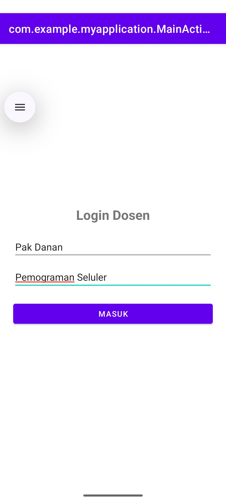
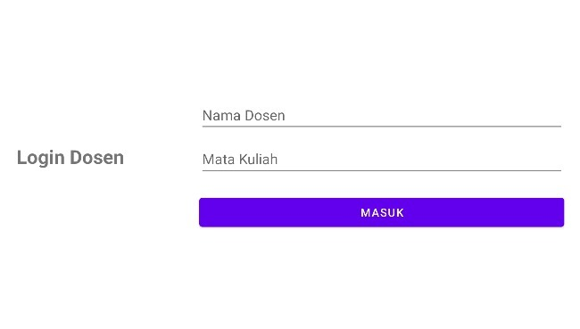
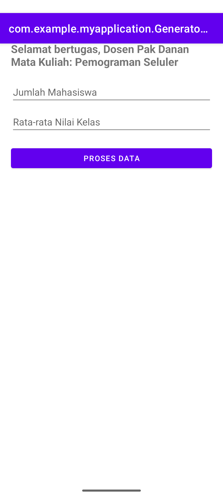
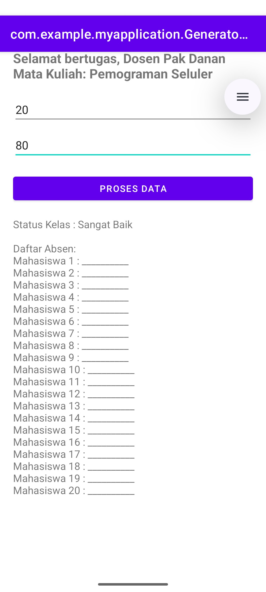

# UTS Pemrograman Seluler - Aplikasi Generator Lembar Penilaian

## Identitas Mahasiswa

- **Nama Lengkap:** Ni Komang Ria Asrini
- **NIM:** 42430014
- **Program Studi:** Pemrograman Seluler

---

## Deskripsi Aplikasi

Aplikasi ini dibangun untuk memenuhi Ujian Tengah Semester (UTS) mata kuliah Pemrograman Seluler. Aplikasi ini menggabungkan materi yang telah dipelajari pada paruh pertama semester, meliputi:

1. **Modul 2 & 3:** Desain UI/UX dan penerapan Layout Responsif (beradaptasi saat *Portrait* dan *Landscape* menggunakan folder `layout-land`).
2. **Modul 4:** Navigasi multi-layer dan **Data Passing** menggunakan `Intent` (mengirim input data dosen ke halaman panel).
3. **Modul 5:** Alur Kontrol Implementasi:
    - Menggunakan percabangan **If-Else** untuk menentukan status kelas.
    - Menggunakan perulangan **For Loop** untuk mencetak daftar absen/lembar penilaian secara otomatis.

---

# Screenshot Aplikasi

*(Catatan: Ganti link gambar dengan screenshot aplikasi Anda)*

---

## 1. Halaman Login (Responsif)

| Mode Potret                | Mode Lanskap                  |
|----------------------------|-------------------------------|
|  |  |

---

## 2. Generator Panel Halaman

| Data Masukan           | Hasil Generate (If-Else & Loop) |
|------------------------|---------------------------------|
|  |                |

---

## Cara Menjalankan Aplikasi

1. Clone repository ini
2. Buka project menggunakan **Android Studio**
3. Jalankan aplikasi menggunakan **Emulator / Device Android**
4. Masukkan data dosen dan nilai mahasiswa
5. Tekan tombol **Proses Data** untuk menghasilkan lembar evaluasi

---

## Teknologi yang Digunakan

- Android Studio
- Java
- XML Layout
- Intent (Data Passing)
- If-Else
- For Loop
